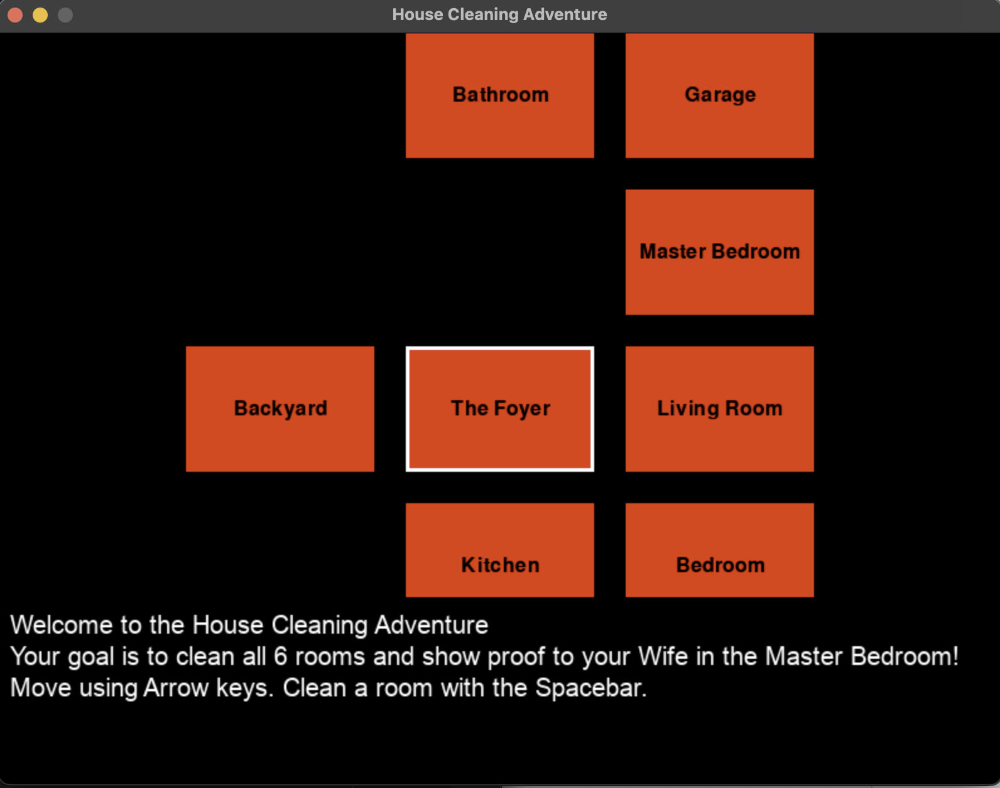
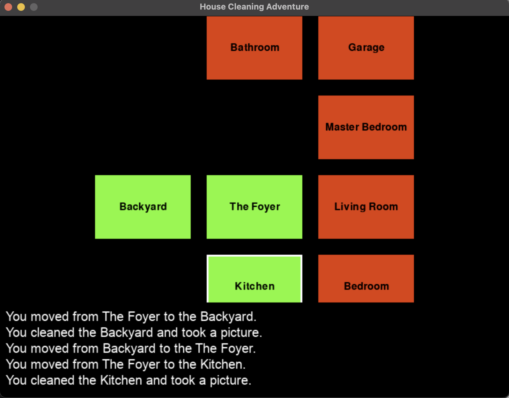

# Software Design and Engineering Enhancement

For this enhancement, I went with my IT 140 text-based game called House Cleaning Adventure. I created it almost two years ago now in my first Python course here at SNHU. Today for this section of the artifact enhancement I included this artifact in my ePortfolio because I felt for my current interests, I would be able to enhance this artifact throughout the course for each category of enhancements to be made while fulfilling all our course outcomes. It also played a role in that this being one of my first projects in the CS program at SNHU it would best showcase how much I have improved throughout the program. This artifact will best present my ability to enhance my existing code and apply new technologies that I did not originally use like Pygame to improve the overall user experience of the game.

Currently, the enhancements I have been able to make so far include transforming the game from a text-based interface to a graphical user interface (GUI) using Pygame. So far, I have the rooms made using rectangles as placeholders while I finish drawing the actual images, there will be a clean version of the rooms and an unclean version that will be drawn depending on whether the user has cleaned the room or not. For the user, it also is a placeholder with the ability to move to each room and clean using the arrow keys for movements and the spacebar as the cleaning action. No more typing north, south, east, west, or clean! As well as a textbox to keep the user informed while playing.

Now the code is much more modular. This has made me feel a lot more comfortable with adjusting and planning for the next phases of the enhancements. Overall, I think this was great progress towards my plan of getting the 2D game into play. I have more improvements to make to polish this section up and it is moving in the right direction.

As far as course outcomes I do feel I have met the one I had planned in Module One. I have reached outcome 2 by enhancing how the text-based game is visually communicated through a graphic rendering of the game. I have also completed course outcome 4 by using Pygame to implement my solution of converting a text-based game to a 2D rendering. Lastly, reaching course outcome 5 by making sure the overall design of the interface cannot be breached to get to the database. 

 Looking over the enhancements made on this part of the artifact I learned so much from using Pygame. First, I was very surprised how much of what I had already coded in the original would help me with the basic logic of outlining the game. Splitting many of the functions into classes such as player, room, utils, and constants made it much easier to think through the planning of what each piece of the program would take care of. Some of the challenges I faced during the enhancements were wanting to make more improvements, but I had to realize there would be more time to polish and make the game do more of what I had originally envisioned. Making it modular and completing what I could do I feel will set me up to make the changes necessary for upcoming enhancements and even future additions. 

**Key Changes:**
- Introduced a GUI using Pygame, replacing text-based commands with arrow keys and spacebar actions.
- Refactored the code into modular classes and separate files (e.g., `room.py`, `player.py`, `utils.py`, `constants.py`), improving maintainability and scalability.
- Added docstrings, comments, and logical naming conventions for clearer code communication.

**Link to Original Code:**
[Original Text-Based Code](https://github.com/briggs8933/CS-499-Capstone/blob/main/Original%20House%20Cleaning%20Adventure/TextBasedGame.py)

**Link to Enhanced Code:**
[Enhanced Code Directory](https://github.com/briggs8933/CS-499-Capstone/tree/main/Enhanced%20House%20Cleaning%20Adventure)

**Outcome Alignment:**
- **Outcome 1:** The first enhancement best demonstrates building collaborative environments. Modular code and thorough documentation enable easy understanding and future teamwork.
- **Outcome 2:** The GUI and improved code clarity allow both technical and non-technical audiences to interact with and understand the project.
- **Outcome 4:** Using Pygame and adopting industry-standard architectural practices show my ability to implement well-founded, value-driven solutions.
- **Outcome 5:** Initial design choices ensure the interface won’t expose data layers prematurely, considering security from the start.

**Reflections:**
This stage taught me the importance of planning a robust foundation for future enhancements. Although I could not implement every idea immediately, focusing on modularity and user experience sets a strong baseline for upcoming improvements.
